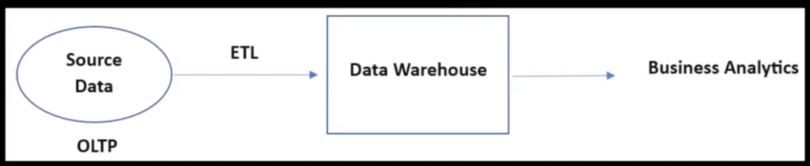
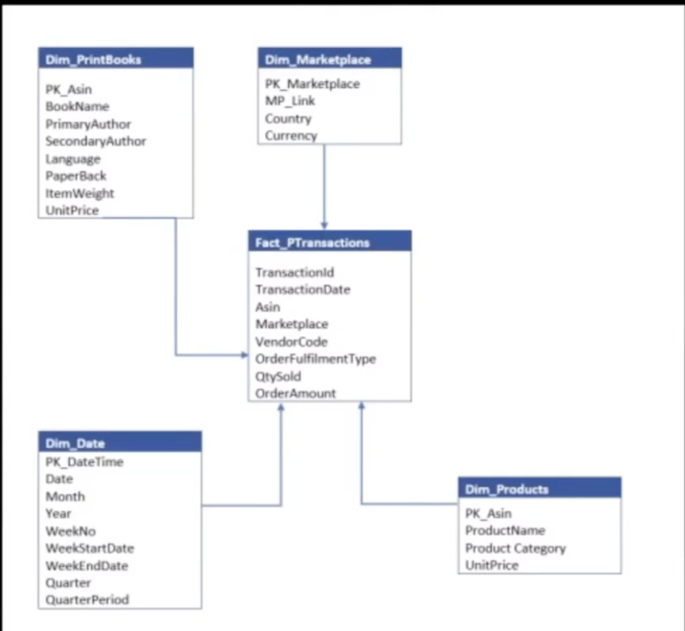
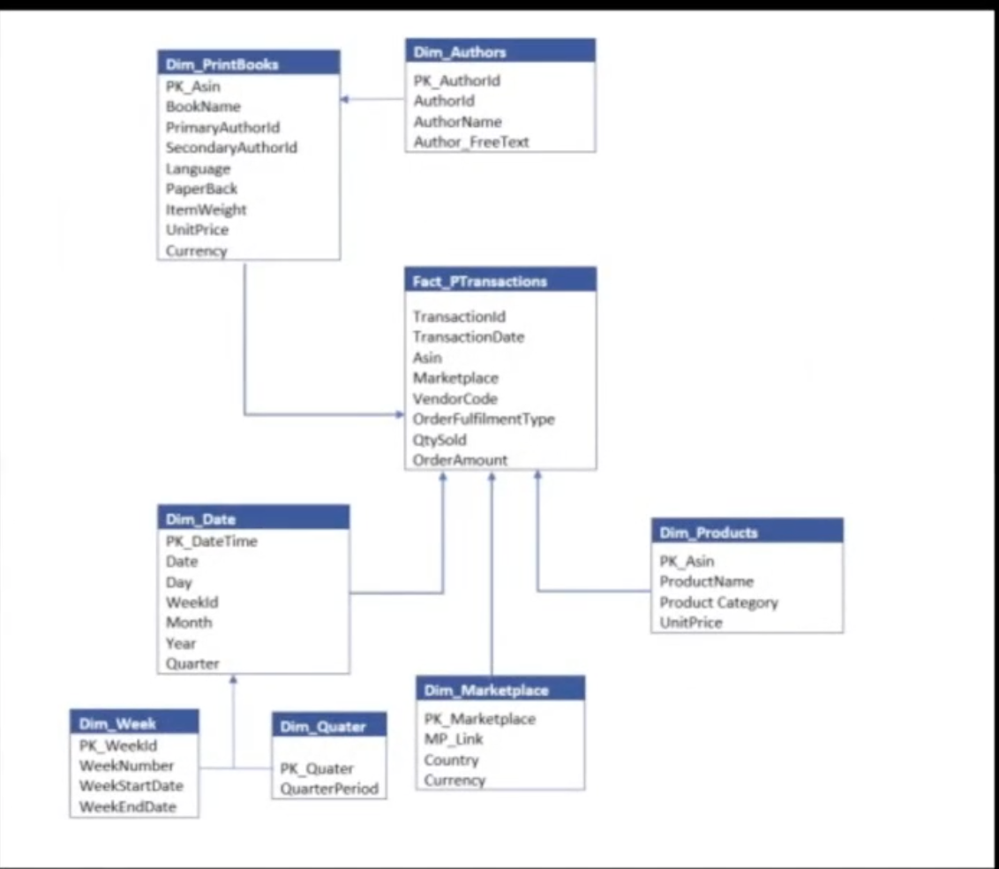

| OLTP (Online Transaction Processing) | OLAP (Online Analytical Processing) |
|--------------------------------------|--------------------------------------|
| Transaction-oriented, manages day to day txn data                | Analyze large volume of historical data for decision making                   |
| DB Admin, DB users, FE users, Developers          | Data Analyst, Data scientist, Data Engineer, Executives                               |
| CRUD operations                              | Mostly read operations, occasional writes                             |
| Handles small amount of data/ txn                                | Handles large volume of data for analysis                              |
| Response time is less                            | Response time is from seconds to hours                                |
| Allows concurrent users                          | Low to moderate users                        |
| Realtime DBs like mysql, oracle, DB2      | Data warehouse systems like Big query, Redshift, Hive

### Data warehouse

Data warehouse is a storage unit environment to support business analytics related activities such as Data Analysis and reporting. Data warehouse is a storage unit environment to support business analytics related activities such as Data Analysis and reporting.

Data in databases is moved to Data warehouses using some ETL pipelines.

Business Analysts or data scientists want to perform analytics on this data. They are not given access to the entire data in the warehouse. We create something called **Data marts** which control the access and only give permissions to access certain tables or data of the warehouse.

Data engineer is responsible for creating pipelines to transfer data to warehouse and creation of data marts.

### OLTP vs OLAP Flow Diagram

Below is a visual representation of the flow between OLTP and OLAP systems:

Data warehouses are used to keep structured data only. i.e. it keeps data only in tables.

Data warehouse also has tables just like databases but they don't follow a schema. We have tables in data warehouse and they have connections between them but they are different from traditional database design.
The approach of designing a data warehouse is known as dimensional modeling.

Data warehouse is usually created at a company level and not at a project level.

**Book**: Kimball the Data warehouse toolkit - to understand on dimension modeling

In dimension model, we structure our data around fact and dimension tables.

Fact are measurements or metrics from your business process. ex: sales_price, order_amount. Facts represent your numbers, transactions or events.

Dimension provides context surrounding business process event. (context surrounding facts). Dimensions provide descriptive values i.e. who, what and where of a fact.

ex: store_type -> dimension because it is not a number  
call_duration -> fact  
shipping_cost -> fact  
doctor_id -> dimension  
browser -> dimension  
visit_cost -> fact  
interest_paid -> fact  
rating -> dimension -> because it provides a context surrounding a   business process context  
clicks -> fact  
overtime -> fact  
month -> dimension  
category -> dimension

Fact tables will contain measurements/ metrics + FK from dimension tables

Dimension tables contain all context related data.

**Building a schema**

1. Star schema: fact table is in center surrounded by series of dimensions. A fact table in center is surrounded by a number of dimension tables.

Dimensions are not connected to each other. They are only connected to fact tables.

2. snowflake schema: extended form of star schema by normalization of dimension tables. i.e. Dimension tables are further categorized for more clarity/ information. Compare the Dim_date from star schema vs snowflake schema.

3. Galaxy schema (constellation schema): Compound schema consisting of more than one fact tables. In star/ snowflake schema we only have 1 fact table. The fact tables are not related to each other. We will not join fact tables.

